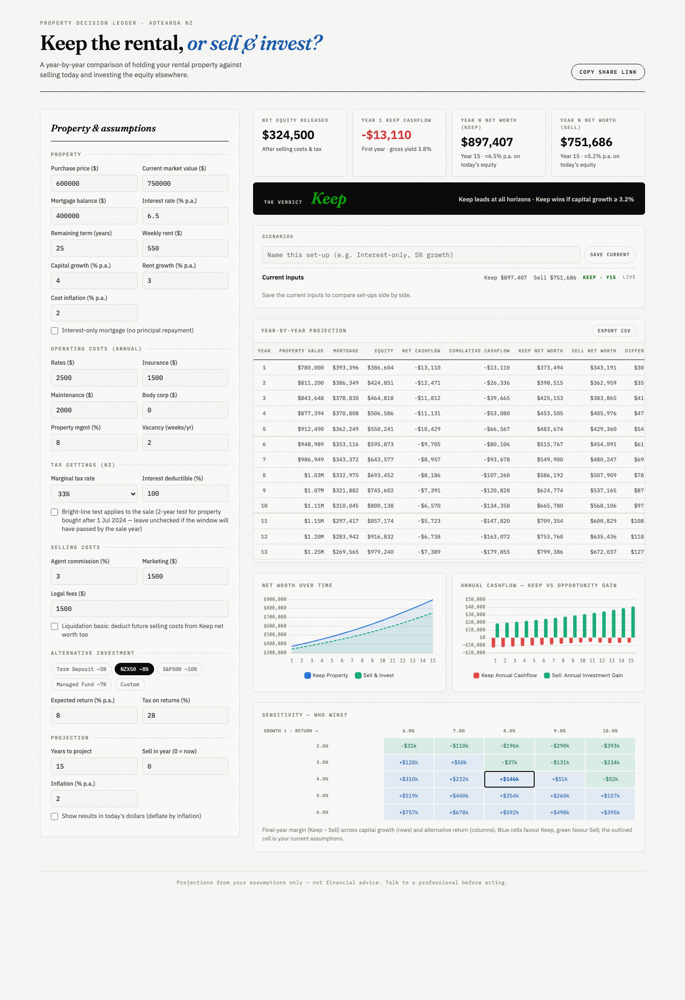

# NZ Rental Calculator — Keep vs Sell

Should you keep your NZ rental property, or sell it and invest the equity?
A single-file, no-build calculator that compares both paths year by year.



## Use it

Open `index.html` in any browser. No server, no build step. Chart.js and
Google Fonts load from CDN; everything else is inline.

- Inputs persist locally and can be shared via **Copy share link** (everything
  is encoded in the URL).
- Save named **scenarios** to compare set-ups side by side.
- **Export CSV** of the year-by-year projection, or print the page for a PDF.

## What it models

NZ-specific tax treatment (ring-fenced rental losses, bright-line test,
interest deductibility, PIE tax on the alternative investment), amortizing or
interest-only mortgages, rent growth and cost inflation, deferred sale
("keep 5 years, then sell"), and an optional today's-dollars view.

The verdict ships with its own uncertainty: a break-even capital growth solver
and a sensitivity grid across growth × alternative return, because the answer
almost always hinges on those two unknowable numbers.

Full methodology, input reference, and assumptions: [plan.md](plan.md).

## Tests

```sh
osascript -l JavaScript tests/run-tests.js
```

Runs the page's real inline script against a stubbed DOM in JavaScriptCore
(built into macOS) and asserts hand-checked model numbers.

## Disclaimer

Projections from your assumptions only — not financial advice.
